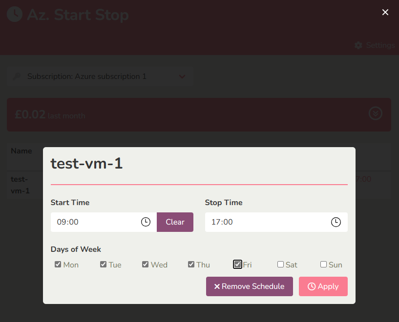

# Az. Start Stop

Az. Start Stop provides a simple interface to define schedules for stopping and starting your Virtual Machines, helping you reduce your compute cost.

<a href="https://vmstartstopdemo.compactcloud.co.uk/">Try it out here!</a>

This solution has been created to address the following key requirements

- User interface to enable your teams to self-manage their compute cost
- Install and managed completely within your own Azure tenancy



# Deployment

Azure (Public)

[](https://portal.azure.com/#create/Microsoft.Template/uri/https%3A%2F%2Fraw.githubusercontent.com%2Fsg3-141-592%2FAzStartStop%2Fmain%2FmainTemplate.json)

After installation you'll need to provide _VM Contributor_ and _Cost Management Reader_ permissions to the User Assigned Managed Identity created during deployment.

# License

This project is licensed under [MIT](./LICENSE.md)

# Contributor Notes

``` bash
# Rebuild frontend styles
cd styles
npm install
npm run css-build

# Run the frontend
cd frontend
npm run serve

# Run function app
npm install -g azurite
azurite -l /tmp/azurite
func start

# Needed if you want to try out commands from the Azure Portal
az functionapp cors add --name compactcloud-startstop-1 --resource-group compactcloud-startstoptestdeploy --allowed-origins https://portal.azure.com

### How to create a new build
# Build the frontend content
# Note there seems to be an issue building with npm 9.8.0, node v20.5.1,
# I've been building using v18.7.1
npm run build
# We have to do this to bundle the front-end with the function app
copy frontend/dist app/dist
# Carry out the build locally creating a full .squashfs build of the app
func azure functionapp publish compactcloud-example-deploy --build local --build-native-deps
```
